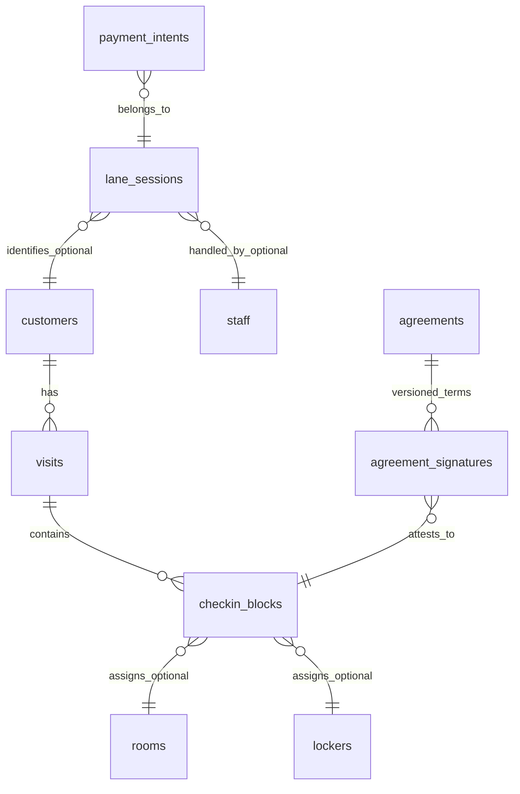

# ClubOperationsPOS Database Entity Details

**Status:** Draft v0.1 (Demo contract)

This document is a companion to `DATABASE_SOURCE_OF_TRUTH.md`. It defines the canonical entity shapes, meanings, and invariants required for a unified working demo across:
- `apps/employee-register`
- `apps/customer-kiosk`
- `apps/office-dashboard`
- `services/api`

## Scope

This document covers the demo-critical tables:
- `customers`
- `lane_sessions`
- `payment_intents`
- `visits`
- `checkin_blocks`
- `rooms`
- `lockers`
- `agreements`
- `agreement_signatures`

If a table or column is not defined here, it is not part of the stable demo contract.

## Conventions

### IDs
- All primary keys are `UUID` with `gen_random_uuid()` default.

### Timestamps
- All timestamps are `TIMESTAMPTZ` and interpreted as UTC.

### “Stay” definition
For the purposes of operations and reporting, a **stay** is a single time-bounded occupancy segment. In the schema, a stay maps to **one** `checkin_blocks` row.

This matches the requirement:
- Every initial check-in requires a new agreement.
- Every renewal requires a new agreement.
- Therefore: every `checkin_blocks` row MUST have a signed agreement artifact.

### Relationship overview

Notes:
- A `checkin_blocks` row MUST reference exactly one resource: either `room_id` or `locker_id`.
- A `visit` groups one or more blocks. A renewal appends a new block to the active visit.

---

## Entity specifications

Each entity below uses the same structure:
- Purpose
- Writers and readers
- Columns
- Constraints and invariants
- Index expectations
- Deprecations and alignment notes

---

## customers

### Purpose
Canonical identity record for a guest (members and non-members). A customer may have an optional `membership_number`.

### Canonical writers
- `services/api` check-in routes that create or update a customer from:
  - an ID scan (name and DOB) and or
  - a membership card (membership number)

### Canonical readers
- employee-register: guest header, notes, past-due status, last visit
- customer-kiosk: welcome screen language and name
- office-dashboard: search, reporting

### Columns

| Column | Type | Required | Meaning |
|---|---:|:---:|---|
| id | UUID | yes | Primary key |
| name | VARCHAR(255) | yes | Legal name as captured from ID or membership system |
| dob | DATE | no | Date of birth. May be null if the ID could not be parsed |
| membership_number | VARCHAR(50) | no | Unique membership identifier when present |
| membership_card_type | VARCHAR(20) | no | Example values: `NONE`, `SIX_MONTH` (exact set may expand) |
| membership_valid_until | DATE | no | Membership expiration if applicable |
| banned_until | TIMESTAMPTZ | no | If not null and in the future, customer is banned |
| id_scan_hash | VARCHAR(255) | no | Optional hash of scan payload for dedupe and faster lookup going forward |
| id_scan_value | TEXT | no | Optional raw scan payload. Must not be stored unencrypted in production |
| primary_language | TEXT | no | `EN` or `ES` |
| notes | TEXT | no | Internal notes shown on employee-register |
| past_due_balance | DECIMAL(10,2) | yes | Balance owed. Default 0 |
| created_at | TIMESTAMPTZ | yes | Created timestamp |
| updated_at | TIMESTAMPTZ | yes | Updated timestamp |

### Constraints and invariants
- `membership_number` MUST be unique when present.
- `primary_language` MUST be `EN` or `ES` when present.
- `past_due_balance` MUST be greater than or equal to 0.

### Index expectations
- Index on `membership_number` (partial where not null).
- Index on `id_scan_hash` (partial where not null).
- Index on `banned_until` (partial where not null).

### Deprecations and alignment notes
- `members` is legacy and is not the source of truth for identity.

---

## lane_sessions

### Purpose
Ephemeral, multi-device orchestration record for a single lane (employee-register + customer-kiosk pair). This is the live state machine that drives the demo UI.

### Canonical writers
- `services/api` check-in endpoints only (scan ID, propose selection, confirm selection, create payment intent, mark payment result, sign agreement, reset lane)

### Canonical readers
- employee-register: live check-in workflow UI
- customer-kiosk: live check-in workflow UI
- office-dashboard: live lane monitoring

### Columns

| Column | Type | Required | Meaning |
|---|---:|:---:|---|
| id | UUID | yes | Primary key |
| lane_id | VARCHAR(50) | yes | Stable identifier for the lane |
| status | lane_session_status | yes | State machine status |
| staff_id | UUID | no | Staff currently operating the lane |
| customer_id | UUID | no | Linked customer identity when known |
| customer_display_name | VARCHAR(255) | no | Snapshot of display name for UI. Derived from `customers.name` when available |
| membership_number | VARCHAR(50) | no | Snapshot of membership number for UI. Derived from `customers.membership_number` when available |
| checkin_mode | VARCHAR(20) | yes | `CHECKIN` or `RENEWAL` (canonical). Legacy values may exist historically |
| desired_rental_type | rental_type | no | Canonical locked selection once confirmed |
| proposed_rental_type | rental_type | no | Current proposal |
| proposed_by | VARCHAR(20) | no | `CUSTOMER` or `EMPLOYEE` |
| selection_confirmed | BOOLEAN | yes | Indicates selection is locked |
| selection_confirmed_by | VARCHAR(20) | no | `CUSTOMER` or `EMPLOYEE` |
| selection_locked_at | TIMESTAMPTZ | no | When the selection was locked |
| waitlist_desired_type | rental_type | no | Future-facing, not required for the demo |
| backup_rental_type | rental_type | no | Optional fallback selection |
| assigned_resource_id | UUID | no | Live snapshot of the assigned room or locker |
| assigned_resource_type | VARCHAR(20) | no | `room` or `locker` |
| price_quote_json | JSONB | no | Optional preview quote (non-canonical once a payment intent exists) |
| disclaimers_ack_json | JSONB | no | Canonical for upgrade and waitlist disclaimers only |
| payment_intent_id | UUID | no | Pointer to created payment intent (must match the payment_intents row for this lane session) |
| past_due_bypassed | BOOLEAN | yes | Whether past due enforcement was bypassed |
| past_due_bypassed_by_staff_id | UUID | no | Staff who bypassed past due |
| past_due_bypassed_at | TIMESTAMPTZ | no | When bypass occurred |
| last_payment_decline_reason | TEXT | no | Most recent decline reason shown on employee-register |
| last_payment_decline_at | TIMESTAMPTZ | no | Timestamp of last decline |
| last_past_due_decline_reason | TEXT | no | Most recent past-due decline reason |
| last_past_due_decline_at | TIMESTAMPTZ | no | Timestamp of last past-due decline |
| created_at | TIMESTAMPTZ | yes | Created timestamp |
| updated_at | TIMESTAMPTZ | yes | Updated timestamp |

### Constraints and invariants
- For a given `lane_id`, there MUST be at most one active session at a time where `status` is not `IDLE`, `COMPLETED`, or `CANCELLED`.
- `checkin_mode` MUST be `CHECKIN` or `RENEWAL`.
- Selection locking:
  - If `selection_confirmed = true` then `selection_locked_at` MUST be non-null.
  - If `selection_confirmed = true` then `desired_rental_type` MUST be non-null.
- Assignment snapshot:
  - If `assigned_resource_id` is non-null then `assigned_resource_type` MUST be `room` or `locker`.
- `price_quote_json` is non-canonical once a `payment_intents` row exists.

### Index expectations
- Index on `lane_id`.
- Partial index on `(lane_id, status)` for active statuses.
- Index on `customer_id` (partial where not null).
- Index on `staff_id` (partial where not null).

### Deprecations and alignment notes
- The database currently contains legacy `checkin_mode` values (example: `INITIAL`). The canonical value is `CHECKIN`.
- The database currently allows `disclaimers_ack_json` to be used as a general blob. For the stable contract, signature data MUST NOT live here.

---

## payment_intents

### Purpose
Represents an amount due for a lane session, including its final pricing breakdown and the demo payment outcome.

### Canonical writers
- `services/api` check-in endpoints:
  - create payment intent (quote)
  - mark paid or declined (demo buttons)

### Canonical readers
- employee-register: total due, payment status, failure reason
- customer-kiosk: total due and pending state
- office-dashboard: reporting totals by day, register, method

### Columns

| Column | Type | Required | Meaning |
|---|---:|:---:|---|
| id | UUID | yes | Primary key |
| lane_session_id | UUID | yes | The lane session this payment belongs to |
| amount | DECIMAL(10,2) | yes | Total amount due |
| status | payment_status | yes | `DUE`, `PAID`, `CANCELLED`, `REFUNDED` |
| quote_json | JSONB | yes | Canonical price breakdown |
| payment_method | TEXT | no | `CASH` or `CREDIT` |
| register_number | INT | no | 1 or 2 |
| square_transaction_id | VARCHAR(255) | no | External processor transaction id if applicable |
| failure_reason | TEXT | no | Reason shown to employee on decline |
| failure_at | TIMESTAMPTZ | no | When decline occurred |
| paid_at | TIMESTAMPTZ | no | When payment became paid |
| created_at | TIMESTAMPTZ | yes | Created timestamp |
| updated_at | TIMESTAMPTZ | yes | Updated timestamp |

### Constraints and invariants
- `lane_session_id` MUST be set.
- There MUST be at most one active `DUE` payment intent per lane session.
- If `status = PAID` then:
  - `paid_at` MUST be non-null
  - `payment_method` MUST be non-null
  - `register_number` SHOULD be non-null for reporting
- If `status = DUE` then `paid_at` MUST be null.

### Index expectations
- Index on `lane_session_id`.
- Index on `status`.
- Partial index on `status = DUE`.

### Deprecations and alignment notes
- The schema currently includes both `payment_intents.lane_session_id` and `lane_sessions.payment_intent_id`. For the stable contract:
  - `payment_intents.lane_session_id` is canonical.
  - `lane_sessions.payment_intent_id` is a redundant inverse pointer and MUST match.

---

## visits

### Purpose
Durable record of a customer’s overall presence at the club. A visit may contain multiple blocks (initial check-in, renewal blocks).

### Canonical writers
- `services/api` check-in completion logic (creates visit on initial check-in, appends blocks on renewal)
- checkout completion logic (sets `ended_at`)

### Canonical readers
- employee-register: last visit display
- office-dashboard: reporting and operational history

### Columns

| Column | Type | Required | Meaning |
|---|---:|:---:|---|
| id | UUID | yes | Primary key |
| customer_id | UUID | yes | The visiting customer |
| started_at | TIMESTAMPTZ | yes | Start of the visit |
| ended_at | TIMESTAMPTZ | no | End of visit, null while active |
| created_at | TIMESTAMPTZ | yes | Created timestamp |
| updated_at | TIMESTAMPTZ | yes | Updated timestamp |

### Constraints and invariants
- A customer SHOULD have at most one active visit at a time (`ended_at IS NULL`), unless the club intentionally supports overlapping visits.

### Index expectations
- Index on `customer_id`.
- Partial index for active visits (customer_id, ended_at) where ended_at is null.

---

## checkin_blocks

### Purpose
Canonical durable stay record (time-bounded occupancy) and the authoritative source for:
- assigned room or locker
- checkout time
- agreement PDF for that stay

### Canonical writers
- `services/api` check-in completion logic (creates a block when agreement is signed)

### Canonical readers
- employee-register: occupancy countdown list (derived)
- office-dashboard: availability counts and history
- checkout flows: checklists and late checkout handling

### Columns

| Column | Type | Required | Meaning |
|---|---:|:---:|---|
| id | UUID | yes | Primary key |
| visit_id | UUID | yes | Parent visit |
| block_type | block_type | yes | `INITIAL`, `RENEWAL`, `FINAL2H` |
| starts_at | TIMESTAMPTZ | yes | Start time |
| ends_at | TIMESTAMPTZ | yes | Checkout time |
| rental_type | rental_type | yes | `STANDARD`, `DOUBLE`, `SPECIAL`, `LOCKER`, `GYM_LOCKER` |
| room_id | UUID | no | Assigned room |
| locker_id | UUID | no | Assigned locker |
| session_id | UUID | no | Legacy link to `sessions` during transition |
| agreement_signed | BOOLEAN | yes | Legacy boolean, derived from agreement_signed_at |
| agreement_signed_at | TIMESTAMPTZ | no | When agreement was signed |
| agreement_pdf | BYTEA | no | Signed agreement PDF artifact |
| has_tv_remote | BOOLEAN | yes | Checkout checklist flag |
| created_at | TIMESTAMPTZ | yes | Created timestamp |
| updated_at | TIMESTAMPTZ | yes | Updated timestamp |

### Constraints and invariants
- Exactly one of `room_id` and `locker_id` MUST be non-null.
- `ends_at` MUST be greater than `starts_at`.
- Duration rules for the demo:
  - If `block_type` is `INITIAL` or `RENEWAL`, then `ends_at` MUST equal `starts_at + 6 hours`.
  - If `block_type` is `FINAL2H`, then `ends_at` MUST equal `starts_at + 2 hours`.
- Agreement per stay:
  - For `INITIAL` and `RENEWAL` blocks, `agreement_signed_at` MUST be non-null and `agreement_pdf` MUST be non-null.
  - `agreement_signed` MUST be true when `agreement_signed_at` is set.
- Occupancy:
  - A room or locker MUST NOT have overlapping active blocks. The assignment process MUST ensure only one active block exists per resource at a time.

### Index expectations
- Index on `visit_id`.
- Index on `block_type`.
- Index on `ends_at` (for active occupancy queries).

### Deprecations and alignment notes
- `agreement_signed` should become derived-only in a later cleanup migration.

---

## rooms

### Purpose
Inventory record for a room, including its current operational state.

### Canonical writers
- cleaning workflows (set DIRTY, CLEANING, CLEAN)
- check-in completion (set OCCUPIED)
- checkout completion (clear occupancy and set DIRTY or CLEANING depending on workflow)

### Canonical readers
- employee-register: availability and occupancy countdown list
- office-dashboard: reports and monitoring
- customer-kiosk: assignment display only (number)

### Columns

| Column | Type | Required | Meaning |
|---|---:|:---:|---|
| id | UUID | yes | Primary key |
| number | VARCHAR(20) | yes | Room number, unique |
| type | room_type | yes | Tier classification |
| status | room_status | yes | `DIRTY`, `CLEANING`, `CLEAN`, `OCCUPIED` |
| floor | INTEGER | yes | For grouping or reporting |
| last_status_change | TIMESTAMPTZ | yes | When status last changed |
| assigned_to_customer_id | UUID | no | Which customer is currently assigned (if any) |
| override_flag | BOOLEAN | yes | When true, treat the room as out-of-order or excluded from assignment |
| version | INTEGER | yes | Optimistic locking counter |
| created_at | TIMESTAMPTZ | yes | Created timestamp |
| updated_at | TIMESTAMPTZ | yes | Updated timestamp |

### Constraints and invariants
- `number` MUST be unique.
- Tier constraints for the demo:
  - Allowed tiers: `STANDARD`, `DOUBLE`, `SPECIAL`.
  - Deprecated tiers (`DELUXE`, `VIP`, `LOCKER`) MUST NOT be used for new assignments.
- Out-of-order representation:
  - If `override_flag = true`, the room MUST NOT be considered available even if status is `CLEAN`.

### Index expectations
- Index on `status`.
- Index on `type`.
- Index on `floor`.

### Deprecations and alignment notes
- Some code paths still reference legacy `rooms.assigned_to`. Canonical column is `assigned_to_customer_id`.

---

## lockers

### Purpose
Inventory record for a locker, including its current operational state.

### Canonical writers
- check-in completion (set OCCUPIED, set assigned_to_customer_id)
- checkout completion (clear assignment and set CLEAN or DIRTY depending on workflow)

### Canonical readers
- employee-register: availability and occupancy countdown list
- office-dashboard: monitoring and reports

### Columns

| Column | Type | Required | Meaning |
|---|---:|:---:|---|
| id | UUID | yes | Primary key |
| number | VARCHAR(20) | yes | Locker number, unique |
| status | room_status | yes | Uses shared `room_status` enum |
| assigned_to_customer_id | UUID | no | Which customer is currently assigned (if any) |
| created_at | TIMESTAMPTZ | yes | Created timestamp |
| updated_at | TIMESTAMPTZ | yes | Updated timestamp |

### Constraints and invariants
- `number` MUST be unique.
- If `status = OCCUPIED` then `assigned_to_customer_id` SHOULD be non-null.

### Index expectations
- Index on `status`.

### Deprecations and alignment notes
- If out-of-order lockers become required, add `override_flag` to lockers for parity with rooms.

---

## agreements

### Purpose
Versioned agreement text that is displayed and signed in the customer-kiosk.

### Canonical writers
- management workflow (office-dashboard or admin endpoints) to create new versions and mark one active

### Canonical readers
- customer-kiosk: fetch active agreement content
- employee-register: may show agreement pending or version info
- office-dashboard: administrative view

### Columns

| Column | Type | Required | Meaning |
|---|---:|:---:|---|
| id | UUID | yes | Primary key |
| version | VARCHAR(50) | yes | Human-readable version string |
| title | VARCHAR(255) | yes | Agreement title |
| body_text | TEXT | yes | Agreement text displayed to customer |
| active | BOOLEAN | yes | Whether this agreement is currently active |
| created_at | TIMESTAMPTZ | yes | Created timestamp |

### Constraints and invariants
- There SHOULD be exactly one active agreement at a time.

### Index expectations
- Partial index on `active = true`.

---

## agreement_signatures

### Purpose
Structured signature capture record and agreement text snapshot. This complements `checkin_blocks.agreement_pdf`.

### Canonical writers
- `services/api` agreement signing endpoint

### Canonical readers
- office-dashboard: audit and proof of signature
- reporting tools: signature metrics and dispute resolution

### Canonical contract (target)
For the stable design:
- `agreement_signatures` MUST reference the stay it attests to via `checkin_block_id`.
- The legacy reference to `sessions` should be removed once the transition is complete.

### Columns (current schema plus target usage)

| Column | Type | Required | Meaning |
|---|---:|:---:|---|
| id | UUID | yes | Primary key |
| agreement_id | UUID | yes | Agreement version signed |
| checkin_block_id | UUID | yes | The stay this signature belongs to |
| checkin_id | UUID | legacy | Legacy reference to `sessions(id)` |
| customer_name | VARCHAR(255) | yes | Name at time of signing |
| membership_number | VARCHAR(50) | no | Membership number at time of signing |
| signed_at | TIMESTAMPTZ | yes | When signed |
| signature_png_base64 | TEXT | no | Signature image (optional) |
| signature_strokes_json | JSONB | no | Signature strokes (optional) |
| agreement_text_snapshot | TEXT | yes | Exact text shown at signing |
| agreement_version | VARCHAR(50) | yes | Agreement version string at signing |
| device_id | VARCHAR(255) | no | Device metadata |
| device_type | VARCHAR(50) | no | Device metadata |
| user_agent | TEXT | no | Device metadata |
| ip_address | INET | no | Device metadata |
| created_at | TIMESTAMPTZ | yes | Created timestamp |

### Constraints and invariants
- For the stable contract, `checkin_block_id` MUST be non-null for all new records.
- A given `checkin_block_id` MUST have exactly one signature record.

### Index expectations
- Index on `checkin_block_id` (partial where not null).
- Index on `agreement_id`.
- Index on `signed_at`.

### Deprecations and alignment notes
- The current schema requires `checkin_id` (legacy). A cleanup migration should:
  - make `checkin_id` nullable
  - enforce `checkin_block_id` as NOT NULL for new signatures
  - later drop `checkin_id` entirely

---

## Operational queries supported by this contract

These are the two most important derived queries for the demo.

### Current availability and countdown ordering
For rooms and lockers:
- Available if:
  - status is `CLEAN`
  - assigned_to_customer_id is null
  - for rooms: override_flag is false
- Occupied if:
  - status is `OCCUPIED`
  - an active `checkin_blocks` row exists whose `ends_at` is in the future
- Ordering:
  1) available first
  2) then occupied ordered by `ends_at` ascending (closest checkout first)

### Customer last visit date
- Derived from `visits`:
  - last visit = max(`visits.started_at`) for customer where `ended_at` is not null
  - or, if you treat active visits as “last visit”, use the latest started_at regardless of ended_at

The stable contract should define which interpretation the UI uses. For the demo, “last visit” SHOULD mean the most recent visit start time.

